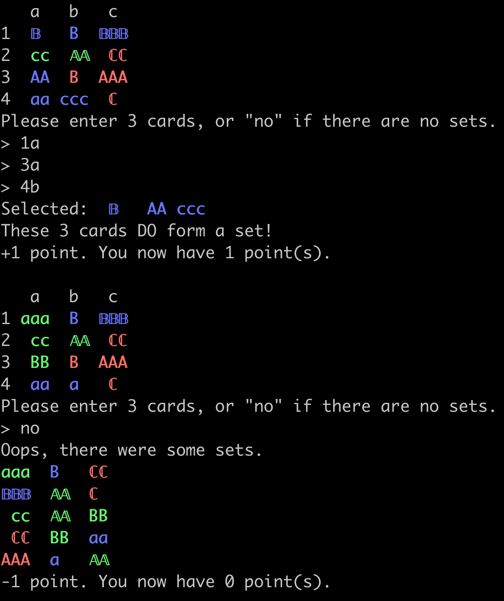

## set-game-cli
Play the card game [Set](https://en.wikipedia.org/wiki/Set_(card_game)) on the CLI.

## Usage
Run with
```
go run set.go
```

## Gameplay


## Interface
This is a commandline implementation of Set. Set has four properties: color, 
shape, number, and shading.

This needs to be adapted for the commandline. On the commandline it is simple to represent
color directly, number by repeating a symbol 1-3 times, and shape by A, B, or C.

The fourth property is more complicated. If there were only two values, it would be easy
to implement with lower and upper case. Since we require a third value, I have chosen to
use lower case, upper case, and "super case", where super case is the unicode codepoint
for upper-case [blackboard bold](https://en.wikipedia.org/wiki/Blackboard_bold).
